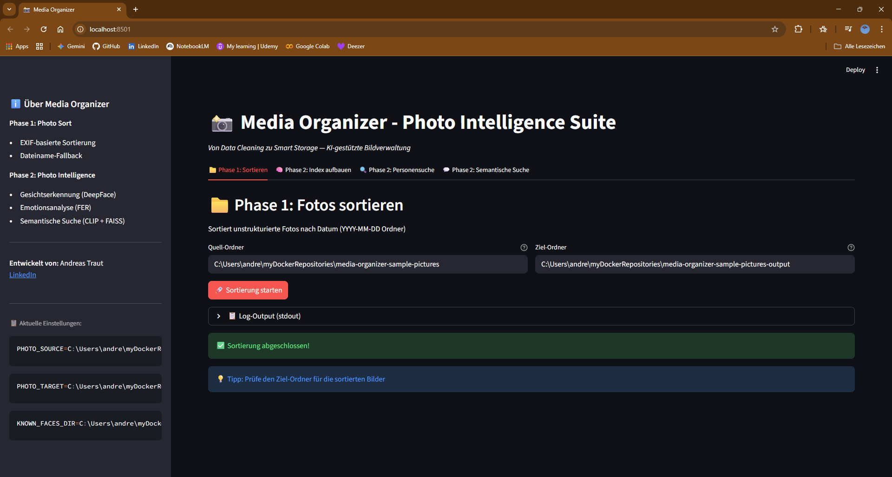
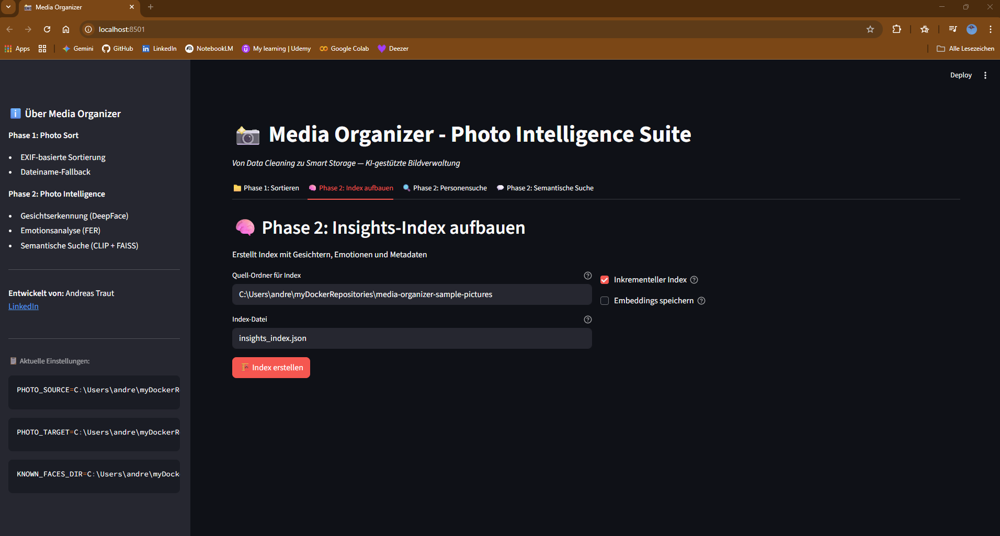
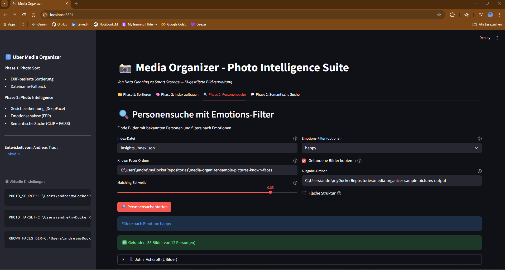
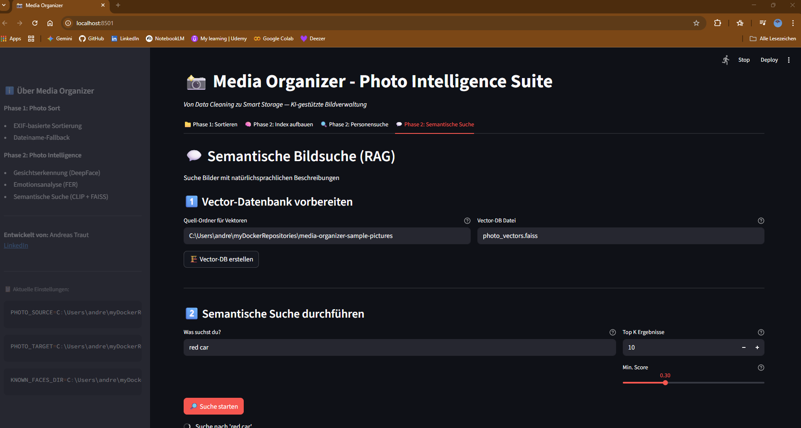

# Streamlit GUI — Grafische Oberfläche für Media Organizer

> 💾 **Modul:** `app.py`  
> 🚀 **Quick Start:** `streamlit run app.py`  
> 🎯 **Zielgruppe:** Nutzer ohne Kommandozeilen-Kenntnisse

---

## 🎯 Überblick

**Zweck:** Browserbasierte grafische Oberfläche, die alle Phasen des media-organizer ohne Code-Kenntnisse zugänglich macht.

**Ansatz:** Single-Page-App mit Tab-Navigation — alle Funktionen aus `photo_sort.py`, `photo_insights.py` und `photo_rag.py` sind über Buttons, Slider und Textfelder steuerbar.

**Die Evolution:** Von Kommandozeilen-Scripts zu einer benutzerfreundlichen Web-App — ideal für BI-Entwickler, die Dashboards bevorzugen, oder für Personen ohne Python-Kenntnisse.

---

## ⚙️ Installation

### Voraussetzungen

- Python 3.8+
- Alle Phase 1 und Phase 2 Dependencies installiert
- `.env` Datei mit `PHOTO_SOURCE`, `PHOTO_TARGET`, `KNOWN_FACES_DIR` konfiguriert

### Schritt 1: Streamlit installieren

**Option A: Nur Streamlit**
```powershell
pip install streamlit
```

**Option B: Alle GUI-Requirements (empfohlen)**
```powershell
pip install -r requirements-gui.txt
```

> 💡 `requirements-gui.txt` enthält alle Dependencies aus Phase 1 + Phase 2 + Streamlit

### Schritt 2: App starten

```powershell
# Im Repository-Root-Verzeichnis
streamlit run app.py
```

Die App öffnet sich automatisch im Browser auf `http://localhost:8501`

> ⚠️ **Wichtig:** Die App muss aus dem Repository-Root gestartet werden, damit die relativen Pfade zu `phase1_photo_sort/` und `phase2_photo_intelligence/` korrekt aufgelöst werden.

---

## 🖼️ Benutzeroberfläche

Die App ist in **4 Haupt-Tabs** organisiert:

### Tab 1: 📁 Phase 1 — Fotos sortieren

**Funktion:** Sortiert unstrukturierte Fotos nach Aufnahmedatum in YYYY-MM-DD Ordner

**Screenshot:**


**Eingabefelder:**
| Feld | Beschreibung | Standard-Wert |
|------|--------------|---------------|
| Quell-Ordner | Ordner mit unsortierten Bildern | `PHOTO_SOURCE` aus `.env` |
| Ziel-Ordner | Ordner für sortierte Bilder | `PHOTO_TARGET` aus `.env` |

**Workflow:**
1. Ordner-Pfade überprüfen/anpassen
2. Button **"🚀 Sortierung starten"** klicken
3. Progress-Spinner zeigt Fortschritt
4. Bei Erfolg: ✅ Bestätigung + Log-Output (optional einblendbar)
5. Bei Fehler: ❌ Fehlermeldung mit Details

**Besonderheiten:**
- Führt `photo_sort.py` als Subprocess aus (keine Code-Änderungen nötig)
- Übergibt Umgebungsvariablen korrekt
- Zeigt Ausgabe des Scripts in Expander-Bereich

---

### Tab 2: 🧠 Phase 2 — Index aufbauen

**Funktion:** Erstellt `insights_index.json` mit Metadaten, Gesichtern und Emotionen

**Screenshot:**


**Eingabefelder:**
| Feld | Beschreibung | Standard-Wert |
|------|--------------|---------------|
| Quell-Ordner für Index | Ordner mit Bildern zum Indexieren | `PHOTO_SOURCE` aus `.env` |
| Index-Datei | Name der Ausgabe-Datei | `insights_index.json` |
| Inkrementeller Index | Nur neue/geänderte Bilder verarbeiten | ✅ (aktiviert) |
| Embeddings speichern | CLIP-Embeddings im Index speichern | ❌ (deaktiviert) |

**Workflow:**
1. Quell-Ordner angeben (oder Standard übernehmen)
2. Optionen wählen (inkrementell empfohlen für schnellere Updates)
3. Button **"🏗️ Index erstellen"** klicken
4. Progress-Bar zeigt Fortschritt
5. Nach Abschluss: Statistik mit Anzahl indexierter Bilder

**Besonderheiten:**
- **Inkrementeller Modus:** Verarbeitet nur neue/geänderte Dateien (spart Zeit bei großen Sammlungen)
- **Embeddings speichern:** Optional — macht Index größer, aber nützlich für spätere Analysen
- **Live-Statistik:** Zeigt direkt nach Abschluss, wie viele Bilder indexiert wurden

**Performance:**
- ~1-2 Min pro 1.000 Bilder
- Empfohlener RAM: 8GB+

---

### Tab 3: 🔍 Phase 2 — Personensuche

**Funktion:** Finde Bilder mit bekannten Personen und filtere nach Emotionen

**Screenshot:**


**Eingabefelder:**

**Linke Spalte (Suche):**
| Feld | Beschreibung | Standard-Wert |
|------|--------------|---------------|
| Index-Datei | Pfad zur Index-Datei | `insights_index.json` |
| Known Faces Ordner | Ordner mit Referenzbildern | `KNOWN_FACES_DIR` aus `.env` |
| Matching-Schwelle | Cosine-Similarity Threshold | `0.85` |

**Rechte Spalte (Filter & Ausgabe):**
| Feld | Beschreibung | Standard-Wert |
|------|--------------|---------------|
| Emotions-Filter | Filtere nach Emotion | `Kein Filter` |
| Gefundene Bilder kopieren | Kopiert Ergebnisse | ❌ (deaktiviert) |
| Ausgabe-Ordner | Zielordner für Kopien | `PHOTO_TARGET` aus `.env` |
| Flache Struktur | Alle Bilder direkt in Personen-Ordner | ❌ (deaktiviert) |

**Workflow:**
1. Index-Datei und Known Faces Ordner angeben
2. **Matching-Schwelle** per Slider einstellen:
   - `0.5` — Sehr locker (viele Treffer, False Positives)
   - `0.85` — Streng (Standard, nur sichere Matches)
   - `0.9+` — Sehr streng (minimale Fehler)
3. **Optional:** Emotions-Filter wählen (happy, sad, angry, etc.)
4. **Optional:** "Gefundene Bilder kopieren" aktivieren
5. Button **"🔎 Personensuche starten"** klicken
6. Ergebnisse werden angezeigt (pro Person expandierbar)
7. Falls Kopieren aktiviert: Statistik mit kopierten/übersprungenen Bildern

**Emotions-Filter:**
| Emotion | Beschreibung |
|---------|--------------|
| `happy` | Glücklich, lächelnd |
| `sad` | Traurig, bedrückt |
| `angry` | Wütend, verärgert |
| `fear` | Ängstlich, verängstigt |
| `surprise` | Überrascht, erstaunt |
| `neutral` | Neutral, ausdruckslos |
| `disgust` | Angeekelt |

**Besonderheiten:**
- **Live-Ergebnis-Vorschau:** Zeigt direkt, wie viele Bilder pro Person gefunden wurden
- **Expandable Sections:** Jede Person hat eigenen Bereich mit Liste der Bildpfade
- **Emotions-Ordner:** Falls Emotion gewählt, wird Struktur `Ziel/Emotion/Person/...` angelegt
- **Statistiken:** Nach Kopieren werden Erfolg/Fehler/Übersprungen angezeigt

---

### Tab 4: 💬 Phase 2 — Semantische Suche

**Funktion:** RAG-basierte semantische Bildsuche mit CLIP + FAISS

**Screenshot:**


**Schritt 1: Vector-Datenbank vorbereiten**

| Feld | Beschreibung | Standard-Wert |
|------|--------------|---------------|
| Quell-Ordner für Vektoren | Ordner mit Bildern für Vector-DB | `PHOTO_SOURCE` aus `.env` |
| Vector-DB Datei | Name der FAISS-Datenbankdatei | `photo_vectors.faiss` |

**Workflow (einmalig):**
1. Quell-Ordner angeben
2. Button **"🏗️ Vector-DB erstellen"** klicken
3. Warten (kann mehrere Minuten dauern)
4. Bei Erfolg: ✅ Bestätigung

> ⚠️ **Wichtig:** Dieser Schritt muss nur **einmal** durchgeführt werden. Danach kann beliebig oft gesucht werden.

---

**Schritt 2: Semantische Suche durchführen**

| Feld | Beschreibung | Standard-Wert |
|------|--------------|---------------|
| Was suchst du? | Natürlichsprachliche Query | *(leer)* |
| Top K Ergebnisse | Anzahl Ergebnisse | `10` |
| Min. Score | Mindest-Ähnlichkeit | `0.3` |

**Workflow (wiederholbar):**
1. Suchbegriff eingeben (z.B. "beach in summer", "dog", "red car")
2. **Optional:** Top K und Min. Score anpassen
3. Button **"🔎 Suche starten"** klicken
4. Ergebnisse werden als Text-Liste angezeigt

**Min. Score Empfehlungen:**
| Wert | Bedeutung |
|------|-----------|
| `0.2` | Sehr locker — viele Treffer |
| `0.3` | Moderat — gute Balance (Standard) |
| `0.4` | Streng — nur gute Matches |
| `0.5+` | Sehr streng — nur sehr ähnliche Bilder |

**Query-Tipps:**
| ✅ Funktioniert gut | ❌ Vermeiden |
|---------------------|--------------|
| Objekte: *"dog"*, *"car"* | Dateinamen: *"Bild123.jpg"* |
| Szenen: *"beach in summer"* | Temporale Referenzen: *"gestern"* |
| Beschreibungen: *"red car"* | Abstrakte Konzepte ohne visuelle Entsprechung |

**Besonderheiten:**
- **Keine Tags nötig:** CLIP versteht Bildinhalte ohne manuelle Annotation
- **Natürlichsprachlich:** Schreibe, wie du sprechen würdest
- **Schnell:** FAISS ermöglicht Suche in tausenden Bildern in Sekunden

---

## 🎛️ Sidebar (Allgemeine Infos)

Die Sidebar zeigt konstant:

**Über Media Organizer:**
- Phase 1 & 2 Features im Überblick
- Link zu LinkedIn-Profil des Autors

**Aktuelle Einstellungen:**
- Zeigt die geladenen Umgebungsvariablen aus `.env`:
  - `PHOTO_SOURCE`
  - `PHOTO_TARGET`
  - `KNOWN_FACES_DIR`

> 💡 Nützlich, um schnell zu überprüfen, welche Ordner aktuell konfiguriert sind.

---

## 🛠️ Technische Details

### Architektur

- **Framework:** Streamlit (Python-basierte Web-App)
- **Backend:** Nutzt die existierenden Module ohne Änderungen:
  - `phase1_photo_sort/photo_sort.py` via `subprocess`
  - `phase2_photo_intelligence/photo_insights.py` via direktem Import
  - `phase2_photo_intelligence/photo_rag.py` via `subprocess`
- **Datenfluss:**
  ```
  Streamlit UI → Parameter sammeln → Module aufrufen → Ergebnisse anzeigen
  ```

### Warum Subprocess statt Import?

- **Phase 1 (photo_sort.py):** Nutzt `if __name__ == '__main__'` Block, der nicht als Modul importierbar ist
- **Phase 2 (photo_rag.py):** Ähnliches Pattern, einfacher via Subprocess
- **Phase 2 (photo_insights.py):** Direkt importierbar, da Funktionen exportiert sind

### Fehlerbehandlung

- **Try-Except Blöcke:** Fangen Fehler ab und zeigen sie benutzerfreundlich an
- **Return-Code Checks:** Bei Subprocess-Aufrufen wird `returncode` geprüft
- **st.exception():** Zeigt vollständige Stack-Traces für Debugging

---

## 💡 Tipps & Best Practices

### Für Anfänger

1. **Starte mit Phase 1:** Sortiere zuerst deine Bilder, bevor du den Index aufbaust
2. **Nutze Defaults:** Die vorausgefüllten Werte aus `.env` sind meist korrekt
3. **Kleine Testläufe:** Teste mit einem kleinen Ordner (~100 Bilder) vor dem großen Lauf
4. **Log-Output lesen:** Bei Fehlern den Expander "📋 Log-Output anzeigen" öffnen

### Für Fortgeschrittene

1. **Inkrementeller Index:** Spart Zeit bei großen Sammlungen (nur neue Bilder)
2. **Threshold-Tuning:** Experimentiere mit Werten zwischen 0.7 und 0.95 für optimale Ergebnisse
3. **Embeddings speichern:** Nur bei Bedarf (z.B. für spätere Analysen), macht Index größer
4. **Min. Score anpassen:** Bei zu vielen irrelevanten Treffern erhöhen, bei zu wenig senken

### Performance-Optimierung

- **RAM:** 8GB+ empfohlen für Phase 2 (Index + Vector-DB)
- **GPU:** Optional für schnellere CLIP-Embeddings (via PyTorch CUDA)
- **Inkrementeller Modus:** Nutze ihn für Updates statt kompletter Neuindizierung
- **Batch-Processing:** Für sehr große Sammlungen (50.000+ Bilder) in kleineren Chargen arbeiten

---

## 🚀 Erweiterte Nutzung

### Deployment auf Server

Die App kann auf einem Server deployed werden, um von mehreren Personen genutzt zu werden:

**Option 1: Streamlit Cloud (kostenlos)**
```powershell
# 1. Repository auf GitHub pushen
# 2. Bei streamlit.io anmelden
# 3. App verlinken
# 4. Secrets (PHOTO_SOURCE, etc.) in Streamlit Dashboard eintragen
```

**Option 2: Eigener Server**
```powershell
# Mit Docker
docker run -p 8501:8501 -v /pfad/zu/fotos:/data streamlit-app

# Oder direkt
streamlit run app.py --server.port 8501 --server.address 0.0.0.0
```

### Anpassungen & Erweiterungen

**Neue Features hinzufügen:**
1. Neuen Tab in `st.tabs()` erstellen
2. UI-Elemente mit Streamlit-Widgets hinzufügen
3. Bestehende Module aufrufen oder neue Funktionen implementieren

**Beispiel: Neuer Tab für Statistiken**
```python
tab5 = st.tabs(["...", "📊 Statistiken"])

with tab5:
    st.header("📊 Sammlungs-Statistiken")
    # Index laden
    index = photo_insights.load_index("insights_index.json")
    # Statistiken anzeigen
    st.metric("Gesamt Bilder", len(index))
    # ... weitere Metriken
```

---

## 🐛 Troubleshooting

### App startet nicht

**Problem:** `ModuleNotFoundError: No module named 'streamlit'`
```powershell
# Lösung: Streamlit installieren
pip install streamlit
```

**Problem:** `No module named 'PIL'`
```powershell
# Lösung: Alle Requirements installieren
pip install -r requirements-gui.txt
```

### Phase 1 Sortierung funktioniert nicht

**Problem:** "Traceback: No module named 'PIL'" im Log-Output

**Ursache:** Subprocess nutzt falschen Python-Interpreter (nicht das venv)

**Lösung:** Bereits behoben via `sys.executable` statt `'python'`

### Index-Aufbau bleibt hängen

**Problem:** Progress-Bar bei 0% stecken

**Mögliche Ursachen:**
- Sehr großer Ordner (10.000+ Bilder) — einfach warten
- DeepFace lädt Modelle beim ersten Mal herunter — dauert ca. 1-2 Min
- Fehler in einem Bild — prüfe Logs

**Lösung:**
- Geduld bei großen Sammlungen
- Bei Fehlern: Einzelne problematische Bilder ausschließen

### Personensuche findet nichts

**Problem:** "Gefunden: 0 Bilder"

**Mögliche Ursachen:**
- Known Faces Ordner leer
- Threshold zu hoch (0.95+)
- Index nicht aktuell

**Lösungen:**
- Mindestens 3-5 Referenzbilder pro Person hinzufügen
- Threshold auf 0.7-0.85 senken
- Index neu aufbauen

---

## 📚 Weiterführende Dokumentation

- **[Phase 1: Photo Sort](PHASE1_PHOTO_SORT.md)** — Details zur Sortier-Logik
- **[Phase 2: Photo Intelligence](PHASE2_PHOTO_INTELLIGENCE.md)** — Technische Details zu DeepFace, CLIP, FAISS
- **[Tools & Hilfsskripte](../tools/TOOLS.md)** — Zusätzliche Utilities
- **[Streamlit Dokumentation](https://docs.streamlit.io/)** — Offizielle Streamlit Docs

---

## ✨ Fazit

Die Streamlit GUI macht alle Funktionen des media-organizer **ohne Kommandozeilen-Kenntnisse zugänglich**. Ideal für:

- **BI-Entwickler**, die Dashboards bevorzugen
- **Nicht-technische Nutzer**, die trotzdem von KI-Features profitieren wollen
- **Schnelles Prototyping** neuer Features mit sofortigem visuellen Feedback
- **Team-Sharing** via Server-Deployment

Von der Sortierung über Gesichtserkennung bis zur semantischen Suche — alles nur einen Klick entfernt.
